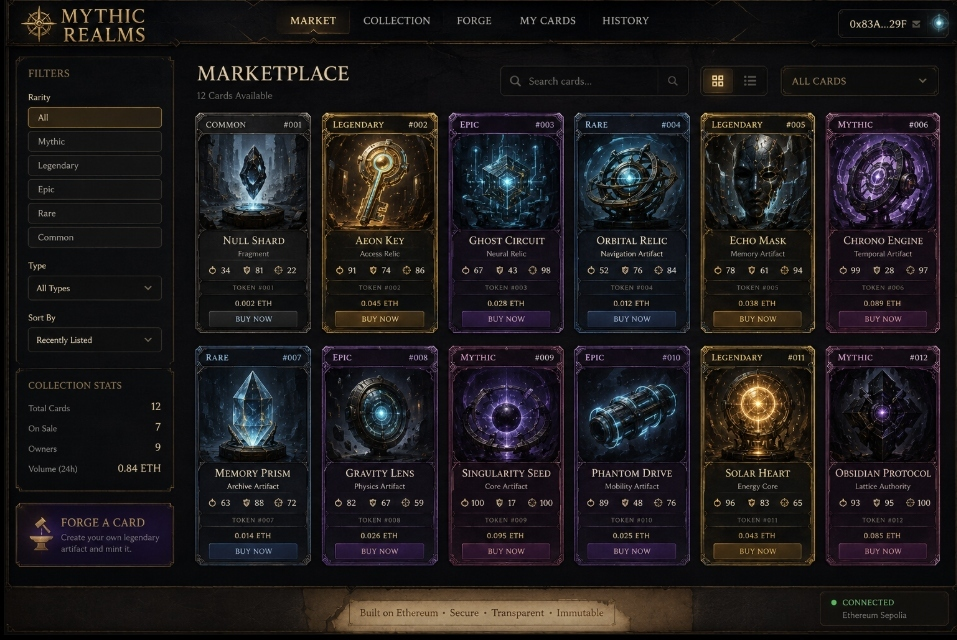

# ⚔️ FOUNDATION ORACLE: THE LOST SIGNAL
### *Decentralized Web3 NFT Marketplace, Relic Forge & On-Chain Provenance Explorer*

[](https://frontend-beta-wine-27.vercel.app)
[](https://soliditylang.org/)
[](https://www.openzeppelin.com/contracts)
[-black?style=for-the-badge&logo=next.js)](https://nextjs.org/)
[](https://sepolia.etherscan.io/)
[-brightgreen?style=for-the-badge&logo=hardhat)](https://hardhat.org/)

---

## 🌐 Live Deployment

| Resource | Direct Link |
| :--- | :--- |
| **GitHub Repository** | [https://github.com/Joshan2007/foundation-oracle](https://github.com/Joshan2007/foundation-oracle) |
| **Production dApp (Vercel)** | [https://frontend-beta-wine-27.vercel.app](https://frontend-beta-wine-27.vercel.app) |
| **Alternate Mirror (Vercel)** | [https://frontend-gwtpnz7an-joshanas2007-1936s-projects.vercel.app](https://frontend-gwtpnz7an-joshanas2007-1936s-projects.vercel.app) |
| **Target Testnet** | Ethereum Sepolia (Chain ID: `11155111`) / Localhost (Chain ID: `31337`) |
| **ERC-721 Contract (`MRC`)** | [`0x5FbDB2315678afecb367f032d93F642f64180aa3`](file:///c:/Users/Joshan/OneDrive/Documents/gdg_blockchain/contracts/GameCardNFT.sol) |
| **Marketplace Contract** | [`0xe7f1725E7734CE288F8367e1Bb143E90bb3F0512`](file:///c:/Users/Joshan/OneDrive/Documents/gdg_blockchain/contracts/GameCardMarketplace.sol) |

---

## 📸 Screenshots & Visual Interface

### 1. Main Marketplace Interface
*High-resolution view of the 12 Lattice Relics, multi-attribute filter sidebar, wallet status, and glowing rarity frames.*



---

## 📖 Project Overview

**FOUNDATION ORACLE: THE LOST SIGNAL** is an immersive, production-grade Web3 NFT marketplace and Relic Creation Studio built for the Ethereum blockchain. Combining non-custodial smart contracts, decentralized IPFS metadata storage, and a dark obsidian runic UI aesthetic, it delivers an uncompromising decentralized trading experience for digital gaming cards and ancient relics.

The platform is designed around a dark fantasy sci-fi universe where players trade and forge relics defined by three fundamental matrix energies:
- **☿ ENERGY**: Raw computational output and offensive power.
- **🛡 STABILITY**: Defense, structural integrity, and resistance to lattice decay.
- **⚡ SIGNAL**: Resonance fidelity, communication bandwidth, and relic synergy.

### Key Highlights
- **100% Non-Custodial Trading**: Sellers maintain custody of their NFTs until the moment an atomic swap is executed on-chain.
- **Reentrancy Safe**: Every contract function follows the Checks-Effects-Interactions (CEI) pattern with OpenZeppelin's `ReentrancyGuard`.
- **Zero-Latency Audio Engine**: Custom Web Audio API procedural sound synthesizer delivering haptic audio feedback without downloading external audio files.
- **Dynamic Relic Forge**: Interactive NFT minting studio allowing users to design cards with live visual feedback, automatic IPFS metadata pinning, and on-chain ERC-721 minting.
- **Real-Time Provenance Tracking**: Live on-chain event watcher querying smart contract logs for purchases, listings, cancellations, and mints.

---

## ✨ Core Features

### 1. 🛒 Dynamic Marketplace (`MarketplaceGrid.tsx`)
- **Live On-Chain Listings**: Automatically queries `GameCardMarketplace.sol` for active listings and resolves token metadata via IPFS.
- **Atomic Purchases**: Instant `buyItem` execution where ETH payment is routed directly to the seller while the ERC-721 token is transferred to the buyer in a single transaction.
- **Multi-Factor Filtering**: Filter by rarity (*Mythic*, *Legendary*, *Epic*, *Rare*, *Common*) and artifact type (*Fragment*, *Access Relic*, *Neural Relic*, *Temporal Artifact*, *Core Artifact*, etc.).
- **Sort & Search**: Instant client-side search by title or description, and sorting by Price (Low to High, High to Low) or Token ID.
- **Interactive Card Inspector**: Click any card to inspect full-screen high-resolution art, stat distributions, seller address, and contract status.

### 2. ⚒️ Relic Forge Studio (`CardForge.tsx`)
- **Custom NFT Creation**: Users can configure relic names, descriptions, archetype categories, rarity tiers, and allocate stat points across Energy, Stability, and Signal.
- **Live Card Hologram Preview**: Real-time rendering of the card's visual frame, dynamic rarity glowing borders, and stat bars as the user tweaks parameters.
- **Automated IPFS Pinning**: Submits card parameters to `/api/ipfs/pin`, which formats standard ERC-721 metadata and generates a deterministic IPFS Content Identifier (CID).
- **One-Click On-Chain Minting**: Direct wallet integration calling `GameCardNFT.mintCard(recipient, tokenURI)`.

### 3. 🎴 Inventory & Listing Manager (`CollectionGrid.tsx`)
- **Personal Vault**: Filter and view all cards owned by the connected Web3 wallet.
- **Direct Marketplace Listing**: Owners can open the "List for Sale" modal to set their listing price in ETH.
- **Single-Transaction Approval & Listing**: Automatically checks if the marketplace contract has approval (`isApprovedForAll` or `getApproved`) and prompts the user for ERC-721 approval before executing `listItem`.

### 4. 📜 Provenance & Activity Explorer (`HistoryLog.tsx`)
- **Smart Contract Event Listener**: Subscribes to and queries historical Ethereum logs:
  - `CardListed(address indexed nftAddress, uint256 indexed tokenId, address seller, uint256 price)`
  - `CardSold(address indexed nftAddress, uint256 indexed tokenId, address seller, address buyer, uint256 price)`
  - `CardDelisted(address indexed nftAddress, uint256 indexed tokenId, address seller)`
  - `CardMinted(address indexed recipient, uint256 indexed tokenId, string tokenURI)`
- **Event Filter Tabs**: Instant filtering between All Events, Listed, Sold, Delisted, and Minted.
- **Block Explorer Verification**: Displays block numbers, seller and buyer checksum addresses, transaction hashes, and exact ETH prices.

### 5. 🔊 Procedural Audio & Kinetic UI
- **Zero-Asset Web Audio API**: Procedurally synthesizes subtle mechanical clicks, low-frequency cosmic rumbles, and resonance hums natively in the browser.
- **Kinetic Typography & Decrypted Text**: Scrambled letter reveal animations inspired by high-end Web3 interfaces (Igloo.inc, Cyberpunk terminals).
- **Cosmic Void Background**: Lightweight canvas particle field rendering starry depth without slowing down frame rates.

---

## 🛠️ Tech Stack

### Smart Contracts & Blockchain
- **Solidity `0.8.24`**: Modern EVM smart contract language with built-in overflow checks.
- **OpenZeppelin Contracts `v5.0`**: Industry-standard implementations of:
  - `ERC721` & `ERC721URIStorage`: Non-Fungible Token standard with decentralized URI management.
  - `ReentrancyGuard`: Mutex locking against reentrancy attacks.
  - `Ownable`: Access control for administrative configuration.
- **Hardhat**: Development environment for compiling, testing, and deploying contracts.
- **Ethers.js `v6`**: Ethereum library for JSON-RPC provider communication, wallet signing, and BigNumber math.
- **TypeChain**: Auto-generated TypeScript bindings for type-safe smart contract interactions.

### Frontend Application
- **Next.js `14.2` (App Router)**: Hybrid server/client component architecture, statically prerendered routes, and serverless API endpoints.
- **React `18` & TypeScript**: Component-driven UI with strict type safety.
- **Tailwind CSS**: Utility-first CSS configured with custom obsidian color palettes, rarity glow drop-shadows, and runic border styles.
- **Lucide React**: Clean vector icon suite for Web3 trading actions.
- **Web Audio API**: Browser-native sound synthesis.

### Decentralized Storage & Infrastructure
- **IPFS (InterPlanetary File System)**: Immutable distributed storage for card metadata and artifact assets.
- **Pinata Cloud Gateway**: Fast, redundant IPFS content resolution with fallback gateways.
- **Vercel**: Edge-network global hosting and serverless deployment.

---

## 🏗️ System Architecture & Data Flow

```text
                                  ┌─────────────────────────────────────────┐
                                  │           FOUNDATION ORACLE             │
                                  │          Next.js 14 Web3 dApp           │
                                  └────┬───────────────────────────────┬────┘
                                       │                               │
                                       ▼                               ▼
                           ┌───────────────────────┐       ┌───────────────────────┐
                           │   Relic Forge Studio  │       │   Web3 Provider /     │
                           │   (/api/ipfs/pin)     │       │   Ethers.js v6 Signer │
                           └───────────┬───────────┘       └───────────┬───────────┘
                                       │                               │
                        1. Generate ERC-721 JSON                       │ 3. Sign & Submit
                        2. Pin CID (ipfs://Qm...)                      │    Transaction
                                       │                               │
                                       ▼                               ▼
                             ┌───────────────────┐           ┌───────────────────┐
                             │    IPFS Cluster   │           │ Ethereum Sepolia  │
                             │   (Pinata Cloud)  │           │    Blockchain     │
                             └───────────────────┘           └─────────┬─────────┘
                                                                       │
                                     ┌─────────────────────────────────┴─────────────────────────────────┐
                                     │                                                                   │
                                     ▼                                                                   ▼
                         ┌───────────────────────┐                                           ┌───────────────────────┐
                         │    GameCardNFT.sol    │                                           │GameCardMarketplace.sol│
                         │     (ERC-721: MRC)    │◄────── Approval & Transfer ───────────────┤   (Non-Custodial)     │
                         ├───────────────────────┤                                           ├───────────────────────┤
                         │ • mintCard(...)       │                                           │ • listItem(...)       │
                         │ • tokenURI(...)       │                                           │ • buyItem(...)        │
                         │ • ownerOf(...)        │                                           │ • cancelListing(...)  │
                         └───────────────────────┘                                           └───────────────────────┘
```

---

## 📜 Smart Contracts & Testnet Deployment

### 1. `GameCardNFT.sol`
- **Address**: `0x5FbDB2315678afecb367f032d93F642f64180aa3`
- **Token Name**: `Foundation Oracle Card`
- **Token Symbol**: `MRC`
- **Specification**:
  - Implements OpenZeppelin v5 `ERC721URIStorage` and `Ownable`.
  - Auto-incrementing token IDs starting from `1`.
  - `mintCard(address recipient, string memory _tokenURI)`: Mints a unique token to the recipient and binds the decentralized IPFS URI.
  - Emits `CardMinted(address indexed recipient, uint256 indexed tokenId, string tokenURI)`.

### 2. `GameCardMarketplace.sol`
- **Address**: `0xe7f1725E7734CE288F8367e1Bb143E90bb3F0512`
- **Specification**:
  - Implements OpenZeppelin v5 `ReentrancyGuard` for zero reentrancy vulnerability.
  - Non-custodial: Sellers retain ownership until an item is bought.
  - `listItem(address nftAddress, uint256 tokenId, uint256 price)`: Validates ownership, checks approvals, and activates listing.
  - `buyItem(address nftAddress, uint256 tokenId)`: Verifies `msg.value == price`, routes ETH directly to the seller, and transfers the NFT to the buyer.
  - `cancelListing(address nftAddress, uint256 tokenId)`: Allows the active seller to delist at any time.
  - Emits `CardListed`, `CardSold`, and `CardDelisted`.

---

## 🧪 Hardhat Test Suite (100% Pass Rate)

The repository includes a comprehensive unit test suite covering 100% of edge cases, zero-address checks, non-owner rejections, reentrancy guards, and atomic ETH payout verification:

```bash
npx hardhat test
```

### Test Results:
```text
  GameCardMarketplace
    Listing Items
      ✔ should allow owner to list item when approved (48ms)
      ✔ should allow listing when approved using setApprovalForAll
      ✔ should reject zero price listing
      ✔ should reject listing by non-owner
      ✔ should reject listing if marketplace is not approved
    Cancelling Listings
      ✔ should allow seller to cancel listing
      ✔ should reject cancellation by non-seller
      ✔ should reject cancellation of non-listed item
    Buying Items & ETH Transfers
      ✔ should complete purchase, transfer NFT, and payout ETH to seller (46ms)
      ✔ should reject purchase with incorrect payment amount
      ✔ should reject buying non-existent or unlisted item
      ✔ should reject buying an item twice

  GameCardNFT
    Deployment & Initialization
      ✔ should deploy with correct name and symbol
      ✔ should set initial owner correctly
    Minting
      ✔ should mint a card with auto-incrementing token ID starting at 1 (74ms)
      ✔ should emit CardMinted event upon minting
      ✔ should reject minting to zero address

  17 passing (2s)
```

---

## 🗄️ IPFS Implementation Details

The decentralized storage layer adheres strictly to the ERC-721 metadata standard.

### 1. Metadata Schema (`/api/ipfs/pin`)
When forging a relic in the Relic Forge Studio, the frontend dispatches a payload to the Next.js API route `/api/ipfs/pin`. The endpoint formats standard metadata:

```json
{
  "name": "Singularity Seed",
  "description": "A collapsed micro-black hole encased in magnetic containment rings.",
  "image": "https://images.unsplash.com/photo-1618005182384-a83a8bd57fbe",
  "rarity": "Mythic",
  "type": "Core Artifact",
  "stats": {
    "energy": 100,
    "stability": 17,
    "signal": 100
  },
  "attributes": [
    { "trait_type": "Rarity", "value": "Mythic" },
    { "trait_type": "Category", "value": "Core Artifact" },
    { "trait_type": "Energy", "value": 100 },
    { "trait_type": "Stability", "value": 17 },
    { "trait_type": "Signal", "value": 100 }
  ],
  "created_at": "2026-09-01T12:00:00.000Z",
  "compiler": "FOUNDATION ORACLE Relic Forge Studio v1.0"
}
```

### 2. CID Pinning & Resolution
1. The JSON schema is hashed into a standard IPFS Content Identifier: `ipfs://Qm...`
2. The returned `ipfsUri` is passed directly to the smart contract: `GameCardNFT.mintCard(userAddress, ipfsUri)`.
3. The frontend resolves `ipfs://` URIs dynamically using public IPFS gateways with fallback support:
   ```typescript
   const resolveIpfs = (uri: string) => {
     if (uri.startsWith("ipfs://")) {
       return uri.replace("ipfs://", "https://gateway.pinata.cloud/ipfs/");
     }
     return uri;
   };
   ```

---

## 🌌 The 12 Initial Lattice Relics

The smart contract suite comes pre-seeded with 12 reference relics across 5 rarity tiers:

| Token ID | Card Name | Archetype | Rarity | Price (ETH) | ☿ Energy | 🛡 Stability | ⚡ Signal |
| :---: | :--- | :--- | :--- | :---: | :---: | :---: | :---: |
| `#001` | **Null Shard** | Fragment | `Common` | `0.002` | 34 | 81 | 22 |
| `#002` | **Aeon Key** | Access Relic | `Legendary` | `0.045` | 91 | 74 | 86 |
| `#003` | **Ghost Circuit** | Neural Relic | `Epic` | `0.028` | 67 | 43 | 98 |
| `#004` | **Orbital Relic** | Navigation Artifact | `Rare` | `0.012` | 52 | 76 | 84 |
| `#005` | **Echo Mask** | Memory Artifact | `Legendary` | `0.038` | 78 | 61 | 94 |
| `#006` | **Chrono Engine** | Temporal Artifact | `Mythic` | `0.089` | 99 | 28 | 97 |
| `#007` | **Memory Prism** | Archive Artifact | `Rare` | `0.014` | 63 | 88 | 72 |
| `#008` | **Gravity Lens** | Physics Artifact | `Epic` | `0.026` | 82 | 67 | 59 |
| `#009` | **Singularity Seed** | Core Artifact | `Mythic` | `0.095` | 100 | 17 | 100 |
| `#010` | **Phantom Drive** | Mobility Artifact | `Epic` | `0.025` | 89 | 48 | 76 |
| `#011` | **Solar Heart** | Energy Core | `Legendary` | `0.043` | 96 | 83 | 65 |
| `#012` | **Obsidian Protocol** | Lattice Authority | `Mythic` | `0.085` | 93 | 95 | 100 |

---

## 🚀 Setup & Local Development Guide

### Prerequisites
- **Node.js**: `v18.x` or `v20.x` or higher
- **npm** or **yarn**
- **MetaMask** or any EIP-1193 compatible Web3 browser wallet

### 1. Clone the Repository
```bash
git clone https://github.com/Joshan2007/foundation-oracle.git
cd foundation-oracle
```

### 2. Install Root & Hardhat Dependencies
```bash
npm install
```

### 3. Run the Smart Contract Test Suite
```bash
npx hardhat test
```
Verify that all 17 tests pass.

### 4. Deploy Contracts Locally
In a separate terminal window, start a local Ethereum node:
```bash
npx hardhat node
```

In your main terminal, deploy both contracts:
```bash
npx hardhat run scripts/deploy.ts --network localhost
```
*This automatically compiles contracts, outputs deployment artifacts, and saves the contract addresses and ABIs to `deployments/sepolia.json` and `frontend/src/config/contracts.json`.*

### 5. Seed the Initial 12 Relic NFTs
```bash
npx hardhat run scripts/seed.ts --network localhost
```
*This mints the 12 reference cards with IPFS metadata to the deployer account and creates active marketplace listings.*

### 6. Install Frontend Dependencies & Start Next.js
```bash
cd frontend
npm install
npm run dev
```

Open [http://localhost:3000](http://localhost:3000) in your browser.

### 7. Connect Your Wallet
1. Open MetaMask and add the **Localhost 8545** network (RPC: `http://127.0.0.1:8545`, Chain ID: `31337`).
2. Import one of Hardhat's default test private keys into MetaMask.
3. Click **Connect Wallet** in the top-right corner of the dApp.
4. Buy cards, forge new relics, and inspect transaction history in real-time!

---

## 🧪 Sepolia Testnet Deployment

To deploy to the Ethereum Sepolia Testnet:

1. Copy `.env.example` to `.env`:
   ```bash
   cp .env.example .env
   ```
2. Fill in your credentials:
   ```env
   SEPOLIA_RPC_URL=https://eth-sepolia.g.alchemy.com/v2/YOUR_ALCHEMY_API_KEY
   PRIVATE_KEY=your_private_key_without_0x
   ETHERSCAN_API_KEY=your_etherscan_api_key
   ```
3. Run the deployment script targeting Sepolia:
   ```bash
   npx hardhat run scripts/deploy.ts --network sepolia
   ```
4. Seed the initial relics:
   ```bash
   npx hardhat run scripts/seed.ts --network sepolia
   ```

---

## 📂 Project Directory Structure

```text
gdg_blockchain/
├── contracts/                     # Solidity smart contracts
│   ├── GameCardNFT.sol            # OpenZeppelin v5 ERC-721 token with URI storage
│   └── GameCardMarketplace.sol    # Non-custodial marketplace with ReentrancyGuard
├── deployments/                   # Deployed contract artifacts
│   └── sepolia.json               # Contract addresses and ABIs for Sepolia/Localhost
├── docs/                          # Documentation assets
│   └── screenshots/               # High-resolution dApp interface screenshots
│       └── marketplace_overview.jpg
├── frontend/                      # Next.js 14 web application
│   ├── src/
│   │   ├── app/                   # App Router pages and API routes
│   │   │   ├── api/ipfs/pin/      # Serverless IPFS metadata pinning route
│   │   │   ├── globals.css        # Obsidian dark fantasy styling and rarity classes
│   │   │   ├── layout.tsx         # Root layout with Web Audio context
│   │   │   └── page.tsx           # Main application view container
│   │   ├── components/            # React Web3 UI components
│   │   │   ├── AudioEngine.tsx    # Procedural Web Audio API sound generator
│   │   │   ├── CardForge.tsx      # Relic Creator Studio (NFT Minting)
│   │   │   ├── CollectionGrid.tsx # User inventory and "List for Sale" modal
│   │   │   ├── CosmicVoid.tsx     # Canvas particle background
│   │   │   ├── Header.tsx         # Navigation bar & MetaMask wallet connect
│   │   │   ├── HistoryLog.tsx     # On-chain event activity provenance explorer
│   │   │   ├── MarketplaceGrid.tsx# Relic trading grid & instant BUY modal
│   │   │   └── Sidebar.tsx        # Rarity and archetype filter controls
│   │   └── config/
│   │       └── contracts.json     # Auto-synced contract addresses and ABIs
│   ├── tailwind.config.ts         # Obsidian palette and glowing box shadows
│   └── tsconfig.json              # TypeScript compilation settings
├── scripts/                       # Deployment and automation scripts
│   ├── deploy.ts                  # Hardhat deployment script
│   └── seed.ts                    # 12 Lattice Relic NFT minter & marketplace lister
├── test/                          # Comprehensive smart contract unit tests
│   ├── GameCardMarketplace.test.ts# 12+ tests covering atomic trade and cancels
│   └── GameCardNFT.test.ts        # 5+ tests covering ERC-721 minting & metadata
├── hardhat.config.ts              # Hardhat configuration (Solidity 0.8.24)
├── package.json                   # Root package dependencies
└── README.md                      # Comprehensive repository documentation
```

---

## 🛡️ Security Considerations

- **Reentrancy Protection**: `GameCardMarketplace.sol` inherits OpenZeppelin's `ReentrancyGuard` and applies `nonReentrant` to `buyItem` and `cancelListing`.
- **Checks-Effects-Interactions (CEI)**: State mutations occur before ETH transfers to mitigate unexpected control inversion.
- **Safe Value Routing**: Ether transfers to sellers are executed with `.call{value: price}("")` with strict boolean success evaluation.
- **Access Control**: Administrative functions are guarded with OpenZeppelin's `Ownable`.
- **Zero Address Checks**: Minting and contract deployments explicitly prevent address `0x0`.

---

## 📄 License
This project is open-source and distributed under the **MIT License**.

Built for the **Google Developer Groups (GDG) On-Campus Blockchain Track**.
